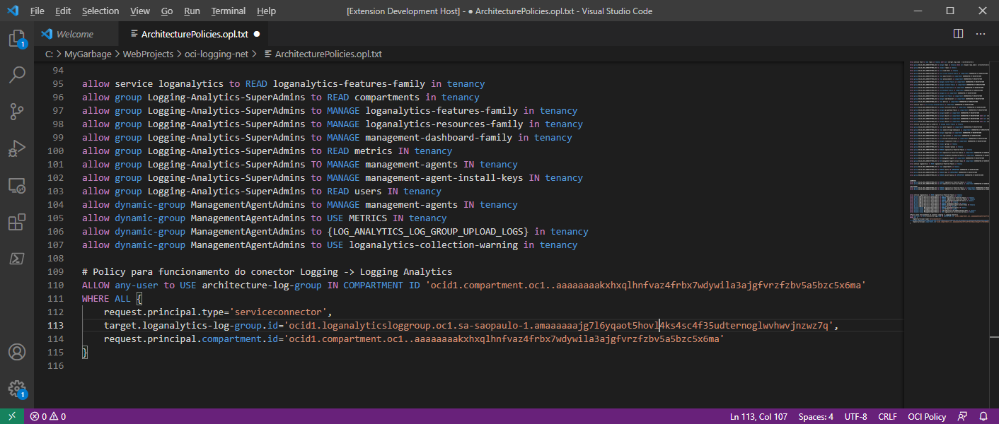

## Visual Studio Code (VSCode) language extention for  OCI Language Policy

This extention is language highlighter for OCI Policies. OCI a policy is a document that specifies who can access which Oracle Cloud Infrastructure resources that your company has, and how. A policy simply allows a group  to work in certain ways with specific types of resources  in a particular compartment. More details in the links bellow:

* [OCI Policy Reference][ocilnk]

* [VS Code Market Place][vscodelnk]

### Screenshot

 <em>(Toggle Test File)</em> 

[vscodelnk]: <https://marketplace.visualstudio.com/items?itemName=joaofelipes.oci-policy-language&ssr=false#overview>
[ocilnk]: <https://marketplace.visualstudio.com/items?itemName=joaofelipes.oci-policy-language&ssr=false#overview>